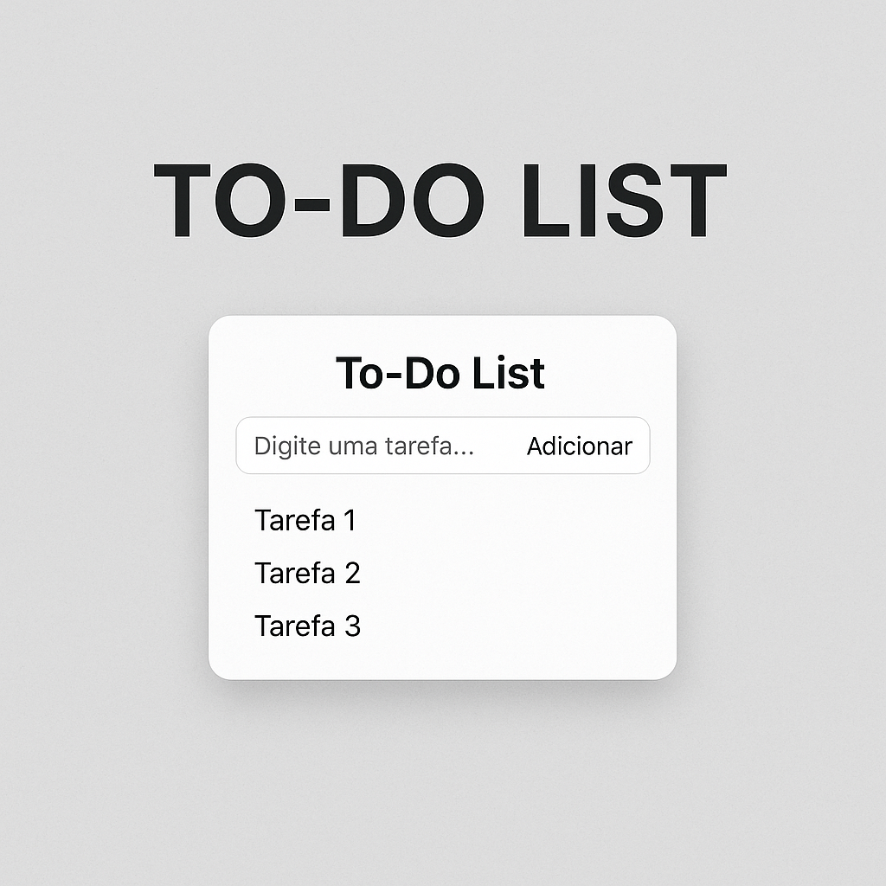

# 📝 To-Do List com JavaScript

Projeto simples de uma lista de tarefas (To-Do List) feito com JavaScript puro.

## 📚 Conceitos praticados

- Manipulação do DOM
- Eventos de formulário
- Arrays e métodos (`push`, `splice`)
- `localStorage`
- Atualização dinâmica da interface

## 💡 Funcionalidades

- Adicionar tarefas
- Remover tarefas clicando nelas
- Armazenamento local (mantém os dados ao recarregar a página)

## 🚀 Como rodar

1. Clone o repositório
2. Abra o `index.html` no navegador

## 📂 Estrutura

todo-list/ 
├── index.html 
├── style.css 
├── script.js 
└── README.md

---

Sinta-se à vontade para evoluir este projeto com:
- Tarefas marcadas como concluídas
- Filtros (pendente/concluído)
- Temas claro/escuro
- Animações com CSS